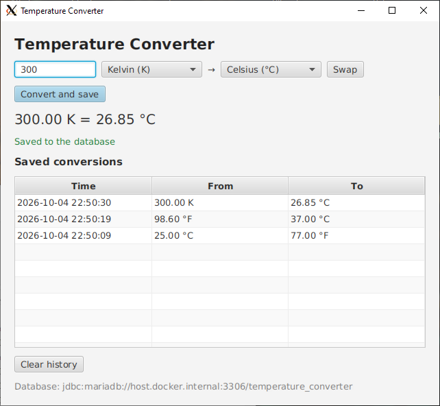
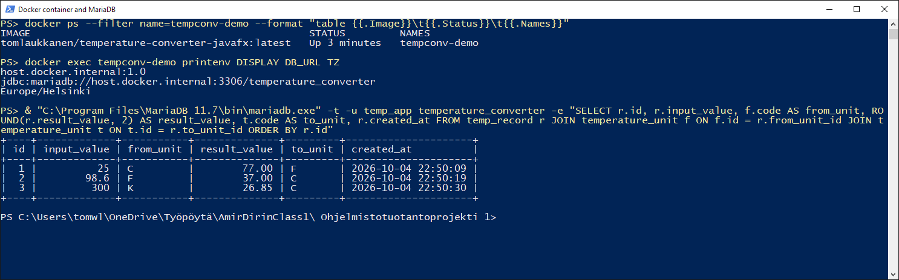

Tom Laukkanen – Ohjelmistotuotantoprojekti 1, individual assignment

## 1. Assignment Description

The task was to build a temperature converter with a graphical user interface that stores its
results in a relational database, and to deliver it with automated tests, code coverage, a Jenkins
CI pipeline and a Docker image.

**Key requirements**

- Convert temperatures between Celsius, Fahrenheit and Kelvin (e.g. 300 K → 26.85 °C).
- A JavaFX GUI where the user types a value, picks the units and sees the result.
- Every conversion is saved to a MariaDB database with **two related tables** (one-to-many).
- Saved conversions are listed in the window and can be cleared.
- Unit tests with JUnit and a JaCoCo coverage report.
- A Jenkins pipeline that builds, tests, reports coverage and pushes a Docker image to Docker Hub.
- The app runs inside Docker, drawing its window on the Windows host through an X server (Xming).

**Deliverables in this repository**

| Deliverable              | Location                                                  |
|--------------------------|-----------------------------------------------------------|
| Source code              | `src/main/java/com/example/`                              |
| Database schema          | `src/main/resources/db/schema.sql`                        |
| Database / user setup    | `database/create_database.sql`                            |
| Unit and GUI tests       | `src/test/java/com/example/`                              |
| Maven build              | `pom.xml`, `mvnw`, `mvnw.cmd`                             |
| Docker image             | `Dockerfile` (published as `tomlaukkanen/temperature-converter-javafx`) |
| CI pipeline              | `Jenkinsfile`                                             |
| Screenshots              | `../img/javafx/`, `../img/inclass4/`                      |

## 2. Technologies & Tools Used

| Category          | Tool                                                                  |
|-------------------|-----------------------------------------------------------------------|
| Language          | Java 21 (`maven.compiler.release` 21)                                 |
| GUI               | JavaFX 21 (`javafx-controls`)                                         |
| Database          | MariaDB 11.7, JDBC with `mariadb-java-client` 3.5                     |
| Build             | Maven 3.9 via the Maven Wrapper, `maven-shade-plugin` (runnable jar), `javafx-maven-plugin` |
| Testing           | JUnit 5 (Jupiter, incl. parameterized tests), H2 2.3 in-memory database in MariaDB mode |
| Coverage          | JaCoCo 0.8                                                            |
| CI/CD             | Jenkins (declarative pipeline), Docker Desktop, Docker Hub            |
| Container display | Xming (X server for Windows)                                          |

## 3. Design Approach & Implementation Method

The app is split into three layers so the conversion logic and the database code can be tested
without the GUI:

```
Main (JavaFX window)
 ├── TempCalculator            conversion formulas and input validation (no UI, no DB)
 ├── TemperatureUnitDAO ─┐
 └── TempRecordDAO ──────┴──> DBConnection ──> MariaDB (or H2 in tests)
```

| Class                | Purpose                                                       |
|----------------------|---------------------------------------------------------------|
| `Main`               | JavaFX window                                                 |
| `Launcher`           | Main class of the runnable jar, starts `Main`                 |
| `TempCalculator`     | Conversion formulas, input parsing, absolute zero check       |
| `DBConnection`       | Opens connections, creates the tables                         |
| `TemperatureUnit`    | One row of `temperature_unit`                                 |
| `TempRecord`         | One row of `temp_record`                                      |
| `TemperatureUnitDAO` | Reads units                                                   |
| `TempRecordDAO`      | Saves, lists (JOIN with both units) and deletes conversions   |

### Conversion logic

`TempCalculator.convert(value, fromCode, toCode)` converts the value to Celsius first and then to the
target unit. This needs only four formulas instead of one per unit pair, and adding a unit would
mean only two more. The calculator also:

- rejects temperatures below absolute zero (with a small tolerance for floating point rounding),
- accepts a comma as the decimal separator (`37,5`), since Finnish users type it that way,
- flags extreme temperatures (below −40 °C or above 50 °C) with a warning in the window.

### Database design

Two related tables, created by the app on start from `src/main/resources/db/schema.sql`:

| Table              | Columns                                                                                         |
|--------------------|-------------------------------------------------------------------------------------------------|
| `temperature_unit` | `id` (PK), `code` (C/F/K, unique), `name`, `symbol`                                             |
| `temp_record`      | `id` (PK), `input_value`, `from_unit_id` (FK), `result_value`, `to_unit_id` (FK), `created_at` |

`temp_record.from_unit_id` and `temp_record.to_unit_id` both reference `temperature_unit.id`
(one unit, many records). Reading the history joins `temperature_unit` twice to get both units.

Key decisions:

- **Units live in the database**, not in an enum. The unit drop-downs are filled from the
  `temperature_unit` table, and the `code` column links each row to `TempCalculator`.
- **The app creates its own schema.** `DBConnection.initializeSchema()` runs `schema.sql` on every
  start. All statements are safe to repeat (`CREATE TABLE IF NOT EXISTS`, `INSERT IGNORE`), so the
  only manual step is creating the database and user once.
- **Configuration through environment variables** (`DB_URL`, `DB_USER`, `DB_PASSWORD`), so the same
  jar connects to `localhost` on Windows and to `host.docker.internal` from Docker.
- **JDBC done safely:** `PreparedStatement` for all queries (no SQL injection) and
  try-with-resources so connections are always closed.

### GUI design

A single `VBox` window: value field, *from* and *to* drop-downs with a **Swap** button,
**Convert and save** (also triggered by Enter), a large result label, a green/red status message,
the **Saved conversions** table (time, from, to; newest first) and **Clear history**.

If the database cannot be reached at start, the window still opens, shows the error and disables
the form instead of crashing. If a save fails, the result is still shown and the error is reported.

### Packaging and deployment

- `maven-shade-plugin` packs the app, JavaFX and the MariaDB driver into one runnable jar.
  `Launcher` exists because Java refuses to start a class that extends `Application` directly from
  a plain jar.
- The `Dockerfile` is multi-stage: a Maven image builds the jar (picking the Linux JavaFX
  libraries), and a slim JRE image with the GTK/X11 libraries runs it. It uses software rendering
  (`-Dprism.order=sw`) because Xming offers no OpenGL that JavaFX can use.
- The `Jenkinsfile` runs: Checkout → Build → Test → Code Coverage → Publish Test Results →
  Publish Coverage Report → Build Docker Image → Push to Docker Hub (tags `latest` and the build
  number).

## 4. Testing & Quality Assurance Steps

### Automated tests

All tests run with `mvnw.cmd clean package`. The database tests use a fresh in-memory **H2**
database in MariaDB mode for each test, so they need no MariaDB server and run the same way
locally and in Jenkins. The GUI tests start the JavaFX toolkit, type into the real controls,
press the buttons and then check both the window and the database.

| Test class                  | Tests | What it verifies                                                                 |
|-----------------------------|------:|----------------------------------------------------------------------------------|
| `TempCalculatorTest`        | 83    | All six conversion directions, reference points (freezing, boiling, −40 °F = −40 °C, 0 K), round trips, extreme-temperature boundaries, absolute zero check, input parsing (comma, whitespace, invalid text, `NaN`/`Infinity`), unknown unit codes |
| `MainTest`                  | 17    | Units loaded from DB, convert-and-save, any unit pair, comma input, extreme warning, invalid / empty / below-absolute-zero input not saved, Swap, history columns, Clear history, save/clear failures, database unavailable at start, window opens |
| `DBConnectionTest`          | 9     | Environment variables and defaults, connection failure, schema parsing, tables and units created, schema can run twice without duplicates or data loss |
| `TempRecordDAOTest`         | 7     | Save assigns an id, read back with both units joined, newest first, delete all, foreign key rejects an unknown unit, missing table raises `SQLException` |
| `TemperatureUnitDAOTest`    | 6     | Find all in order, find by code / id, unknown code / id, missing table           |
| `TempRecordTest`            | 4     | Constructors, `withId`, `toString`                                               |
| `TemperatureUnitTest`       | 4     | Getters, drop-down text, `equals` / `hashCode`                                   |

**Result (`mvnw.cmd clean package`, 2026-10-07):**

```
Tests run: 130, Failures: 0, Errors: 0, Skipped: 0
BUILD SUCCESS
```

**JaCoCo coverage** (`target/site/jacoco/index.html`):

| Metric       | Covered       |
|--------------|---------------|
| Instructions | 98 % (1266 / 1291) |
| Branches     | 97 % (58 / 60)     |
| Lines        | 97 % (252 / 261)   |

The only uncovered code is `Launcher.main` (it just calls `Main.main`) and a few unreachable error
branches (e.g. the database not returning a generated id).

The same tests and coverage report also run in every Jenkins build; screenshots of the pipeline,
the JaCoCo report and Docker Hub are in `../img/inclass4/`.

### Manual tests

| Scenario                                                   | Expected                                              | Result |
|------------------------------------------------------------|-------------------------------------------------------|--------|
| Run the Docker image with Xming on Windows                 | Window opens on the Windows desktop                   | Pass   |
| Convert 25 °C → °F                                         | 77.00 °F, row added to history                        | Pass   |
| Convert 98.6 °F → °C                                       | 37.00 °C                                              | Pass   |
| Convert 300 K → °C                                         | 26.85 °C                                              | Pass   |
| Query MariaDB on the host after the conversions            | Three rows in `temp_record`, units joined correctly, times in Finnish time | Pass   |
| Check container environment (`docker exec … printenv`)     | `DISPLAY`, `DB_URL` and `TZ` set as in the Dockerfile | Pass   |

Invalid input, Swap and Clear history are covered by the automated GUI tests in `MainTest`.





## 5. How to Run

### Prerequisites

- **JDK 21 or newer** with `JAVA_HOME` set (Maven itself comes with the Maven Wrapper)
- **MariaDB** running on `localhost:3306`
- For Docker: **Docker Desktop** and **Xming**

### 1. Create the database (once)

Run as MariaDB root. This creates the `temperature_converter` database and the `temp_app` user:

```
"C:\Program Files\MariaDB 11.7\bin\mariadb.exe" -u root -p < database\create_database.sql
```

The tables are created by the app itself. The connection can be changed with the environment
variables `DB_URL`, `DB_USER` and `DB_PASSWORD`
(defaults: `jdbc:mariadb://localhost:3306/temperature_converter`, `temp_app`).

### 2. Build, test and coverage

```
mvnw.cmd clean package
```

Runs all tests (no MariaDB needed) and writes the JaCoCo report to
`target/site/jacoco/index.html` and the runnable jar to `target/temperature-converter.jar`.

### 3. Run locally

```
mvnw.cmd javafx:run
```

or, after packaging:

```
java -jar target\temperature-converter.jar
```

### 4. Run with Docker

1. Start **Xming** with *XLaunch*: Multiple windows, display number 0, Start no client,
   tick **No Access Control**.
2. Build and run:

```
docker build -t tomlaukkanen/temperature-converter-javafx .
docker run --rm tomlaukkanen/temperature-converter-javafx
```

Or use the published image: `docker pull tomlaukkanen/temperature-converter-javafx`

The image sets `DISPLAY=host.docker.internal:0.0` (Xming on Windows),
`DB_URL=jdbc:mariadb://host.docker.internal:3306/temperature_converter` (MariaDB on Windows) and
`TZ=Europe/Helsinki`. Any of them can be overridden with `docker run -e`, for example
`-e DISPLAY=host.docker.internal:1.0` if Xming uses display 1.

### 5. Jenkins

Create a Pipeline job that uses *Pipeline script from SCM* with this repository and the script path
`OTP1_inclass1_assignment_TomLaukkanen/Jenkinsfile`. The Jenkins agent needs the JUnit and JaCoCo
plugins, and Docker Desktop signed in to Docker Hub as the same Windows user that runs Jenkins.
